Iteration
=========

1.1 Iteration goals
-------------------

WHAT: Design a shared economy platform, the supply side to transfer the right to
use goods or provide services that they can obtain a certain amount of monetary
return; the demand side does not directly own the ownership of the goods,
through rental or borrowed sharing to use the goods, that they can reduce
economic pressure or obtain convenience.

WHO: Every adult who desires to borrow or lend.  
For the lender:  
Valid contact information and a bank card needs to be bound to the online
platform. This ensures the security and reliability of items listed on the
website. It also ensures a contact measure for users to users.

>   For the borrower:  
>   Likewise, a bank card is bound to the online platform, and a phone number or
>   email is reserved. This user selects the item they wish to borrow and
>   returns the item within a specified time.

WHY: Effective sharing for convenience.  
First, the design of a website with shared economy can effectively reduce
investment and save costs. Second, the rational allocation of products and
services and the optimal allocation of resources will be realized. Then, in
accordance with the consumption concept of green development, it is conducive to
promoting sustainable development.

WHERE: Anywhere on the platform.  
This online based platform provides a location search where users can find items
they desire to borrow in their closest proximity.

WHEN: Any time you need.  
The lender can list their items on the platform at any time at their
convenience; the borrower can search for items and book a time frame for use
wherever they need them.

HOW:

For the lender：

Provide personal contact information and bind bank card

>   Publish idle goods or provide services

>   Set prices and rates

Reach consensus with the borrower side

Income through items lent.

For the borrower：

Provide personal contact information bind a bank card

Search for items you need

Select the desired items and the length of time

Reach a consensus with the supplier

Finally, the goods will be returned at a certain period of time.

1.2 Documentation：
-------------------

Iteration Document

Software Design Spec

Software Requirements Spec

Team Principles

User Manual

1.3 Meeting Summaries:
----------------------

| 2019/6/25 Team building We finished building our team today, and team members include Isabella, Royce, Sunny, Grace, Lucas, and Owen. | [./media/image1.jpeg](./media/image1.jpeg) |
|---------------------------------------------------------------------------------------------------------------------------------------|--------------------------------------------|

~   IMG_2021

| 2019/6/26 We got to know each other through MINDMAP, and we designed our team name and logo.                                                                                                                                                                                 | [./media/image3.jpeg](./media/image3.jpeg)   |   |
|------------------------------------------------------------------------------------------------------------------------------------------------------------------------------------------------------------------------------------------------------------------------------|----------------------------------------------|---|
| 2019/6/27 We chose to focus on sharing economy, and companies in the same industry were analyzed by us, such as OFO, Gumtree, Uber. We studied the tea culture in the afternoon, and We tried the different kinds of tea, like West lake longjing tea/ dahongpao/ Green tea. | [./media/image6.jpeg](./media/image6.jpeg)   |   |
| 2019/6/28 We find the innovation of sharing economic, and what innovation? What can be innovation? How to innovation? And we analyzed it with six thinking hats.                                                                                                             | [./media/image10.jpeg](./media/image10.jpeg) |   |
| 2019/7/1 For analysis results, we did customer demand analysis                                                                                                                                                                                                               | [./media/image16.jpeg](./media/image16.jpeg) |   |
| 2019/7/2 In order to ensure the smooth progress of the project, we planned the stages. And we did a simple user interface model on paper.                                                                                                                                    | [./media/image22.jpeg](./media/image22.jpeg) |   |
| 2019/7/4 Make sure our site is simple, clear and useful, we designed the various parts of the site.                                                                                                                                                                          | [./media/image27.jpeg](./media/image27.jpeg) |   |

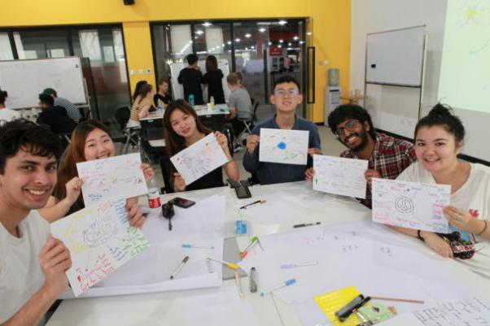

~   IMG_2035

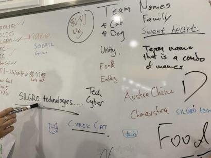

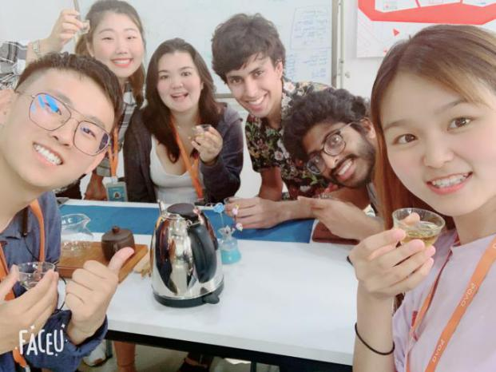

~   IMG_2076

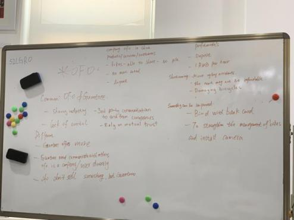

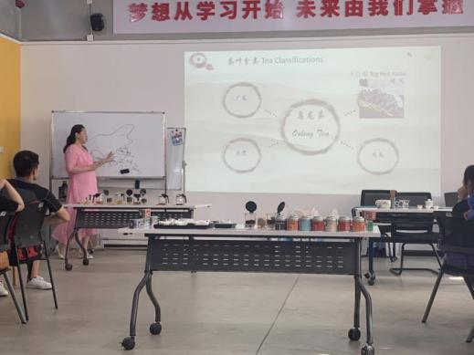

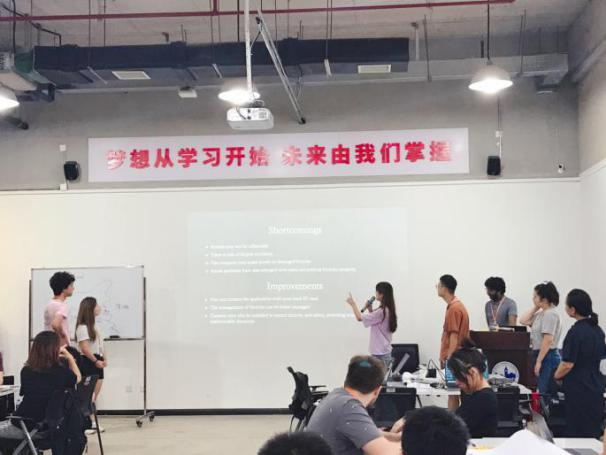

~   IMG_2094

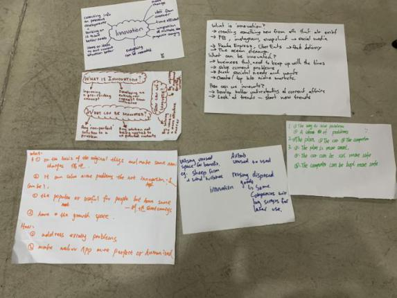

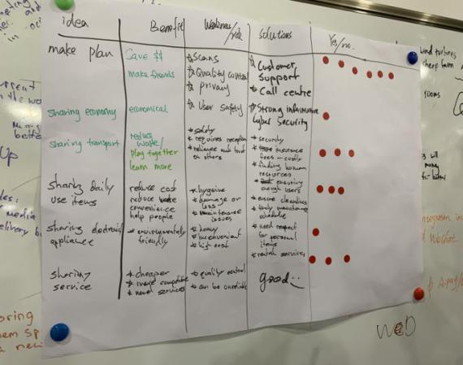

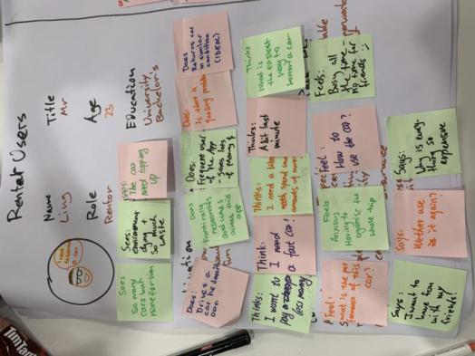

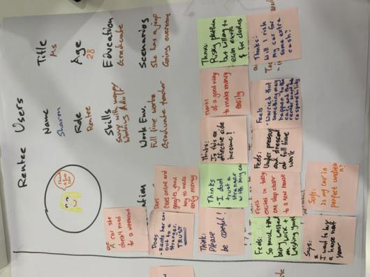

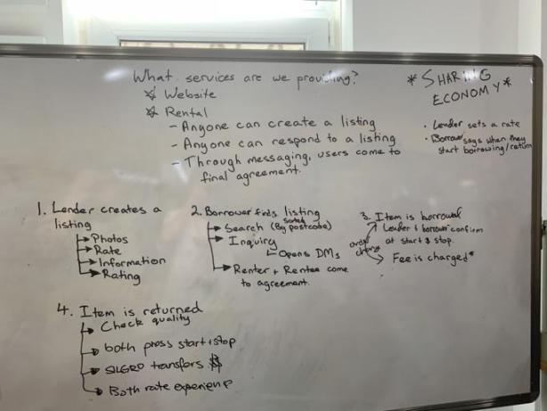

~   IMG_2147

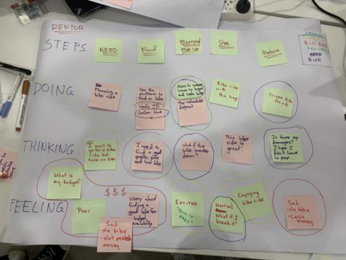

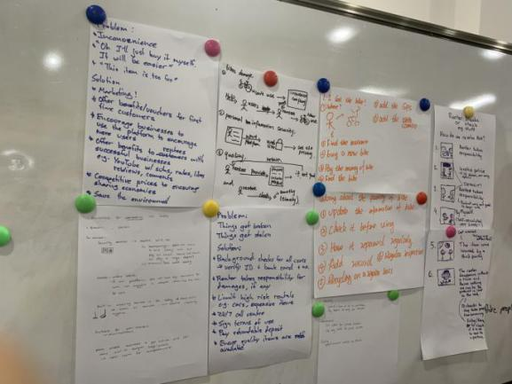

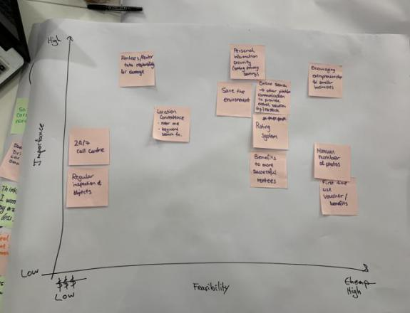

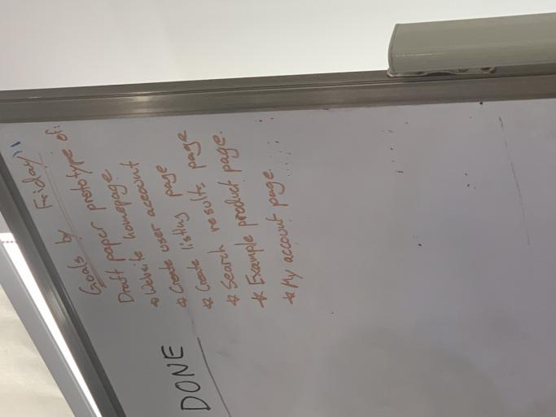

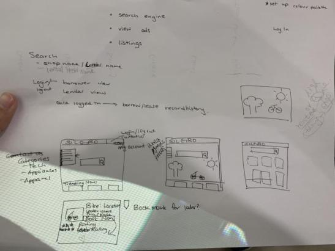

~   IMG_2231

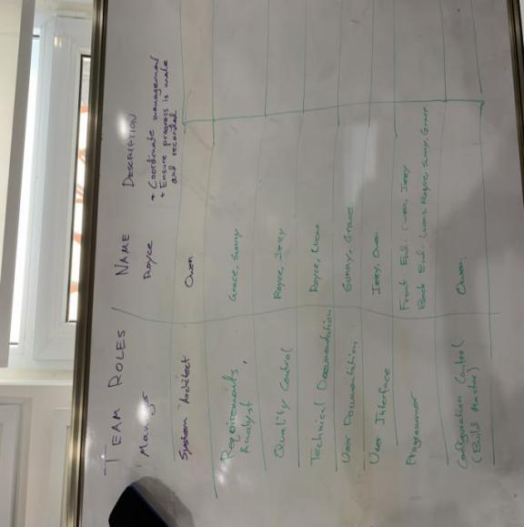

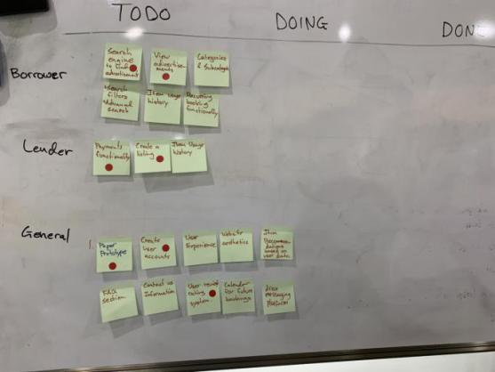

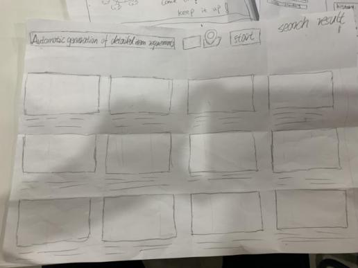

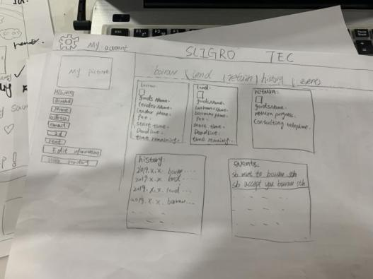

~   IMG_2261

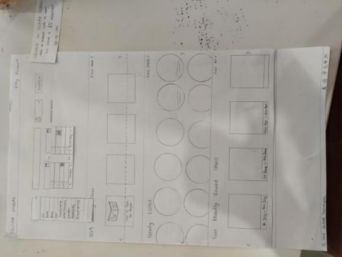

1.4 Process Methods
-------------------

Process

>   Innovation Type

>   Mind Mapping

>   Six Thinking Hats

>   Design Thinking

>   Overview of Team Facilitation

>   Project Overview

Methods

>   Brainstorming

Tools

>   Mind Mapping

>   Six Thinking Hats
